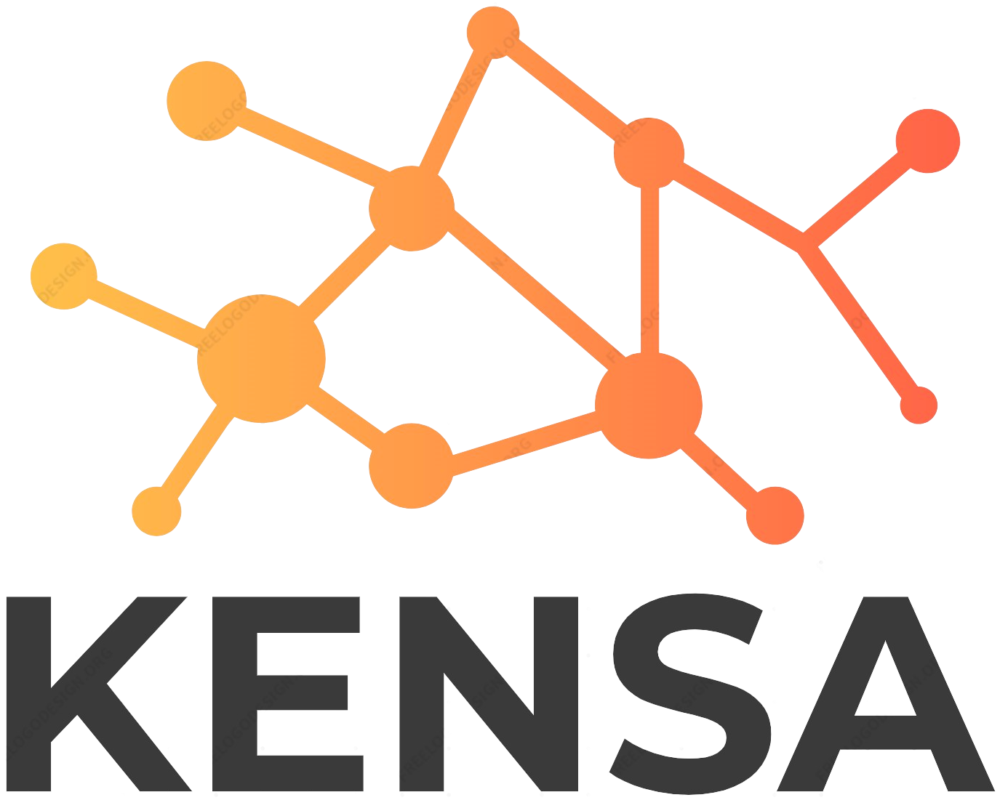

# Kensa

<br />
<p align="center">
  <a href="https://github.com/oslabs-beta/kensa">
    
  </a>

  <!-- <h3 align="center">Kensa</h3> -->

<p align="center">
    A GraphQL monitoring tool. <br />
  <a href="https://medium.com/@raygkim/kensa-8cdecfae73af">Medium Article</a>
    <br />
    <!-- <a href="https://github.com/oslabs-beta/kensa"><strong>Explore the docs »</strong></a> -->
    <br />
    <a href="https://github.com/oslabs-beta/kensa/issues">Report Bug</a>
    ·
    <a href="https://github.com/oslabs-beta/kensa/issues">Request Feature</a>
  

<div align="center">
  <a href="https://github.com/brianhip/kensats/blob/main/LICENSE"></a>
  <a href="https://github.com/oslabs-beta/kensa/issues"></a>
  <a href="https://github.com/oslabs-beta/kensa/issues"></a>

  </div>

<div align="center">
<br />

Accelerated by [OS Labs](https://github.com/open-source-labs)
<br />

Developed by:<br />
Brian Peinado [GitHub](https://github.com/brianhip) | [LinkedIn](https://www.linkedin.com/in/brian-peinado/) <br />
Raymond Kim [GitHub](https://github.com/raymonnd) | [LinkedIn](https://www.linkedin.com/in/raymond-kim0) 
  <br />
Tommy Li [GitHub](https://github.com/tommyli97) | [LinkedIn](https://www.linkedin.com/in/tommyli10)
  <br />
Brian Pham [GitHub](https://github.com/brpham13) |[LinkedIn](https://www.linkedin.com/in/brpham13) 
  <br />

</div>

</p>

<hr>
<!-- TABLE OF CONTENTS -->
<details open="open">
  <summary>Table of Contents</summary>
  <ul>
    <li>
      <a href="#about-the-project">About Kensa</a>
      <ul>
        <li><a href="#built-with">Built With</a></li>
      </ul>
    </li>
    <li><a href="#installation">Installation</a></li>
    <li>
      <a href="#getting-started">Getting Started</a></li>
    </li>
    <li><a href="#contributing">Contributing</a></li>
    <li><a href="#contact">Contact</a></li>
  </ul>
</details>

<hr>

### About Kensa

<br />
Kensa equips developers with the metrics and tools necessary to monitor and test their GraphQL requests, always ensuring the health and performance of their server. After simply installing the NPM package and visiting the Kensats.link web app, developers can analyze metrics on high latency queries, track response data/errors, and view historical logs of recently made or saved queries. With built in GraphQL playground functionality, queries/mutations can be quickly tested against and compared through visual aids such as metric tables and query trees.

<hr>

### Installation

<br />

Install the Kensa NPM Package into your project. Refer <a href="https://www.npmjs.com/package/kensats">here</a> for instruction on how to incorporate the package to your server.

```sh
npm install kensats
```

Then visit <a href="https://kensats.link/">here</a> and sign up for an account to get full access to the Kensa web app.

<a href="https://www.loom.com/share/b56225773efb488d91ba52d632fe8d46">
    
  </a>

<hr>

### Getting Started

<br />
<strong>Create projects</strong>: <br />
Store your own record of projects to easily refer back to for continuous development and keep a log of their response metrics for comparison sake.
<br />
<a href="https://www.loom.com/share/824b6dc1183f4ee88fa75610fdfc6ce5">
    
  </a>
<br />
<br />
<strong>Playground/ Developer mode</strong>:<br />
Avoid the hassle of toggling between different apps and quickly test for different queries/mutations by submitting queries into the input field. View their response data and compare for differences in response data and metrics in the operation log table.
<br />
<a href="https://www.loom.com/share/ba290183644b482baa6bdabe7f2a470f">
    
  </a>
  <br />
<br />

<strong>Query visualization</strong> :<br />
View a tree structured visualization of your query broken down into the schema's fields and their connecting relationships.<br />
<br />
<a href="https://www.loom.com/share/488aac54c9a040feb09ef6cbdc9c4b5b">

</a>

<hr>

### Built With

<ul>
<li>React + React Hooks + React Router</li>
<li>Redux Toolkit</li>
<li>Typescript</li>
<li>GraphQL</li>
<li>Apollo</li>
<li>Node/Express</li>
<li>PostgreSQL</li>
<li>ChakraUI</li>
<li>D3/ChartJS</li>
<li>JWT</li>
  
</ul>

<hr>

### Contributing

<br />

Feel free to show us your support by starring the project.
Raise issues or report on features you'd like to see through GitHub issues.
As part of the Open Source community, all contributions are greatly appreciated, so you're welcome to fork, clone, and make your own pull request on this repo.

Thank you for your interest and support!

<hr>

### Contact

<a href="https://kensats.link">Website</a>
<a href="https://www.linkedin.com/company/kensa-ts/">LinkedIn</a>


### Acknowledgements

Big shout out and thank you to Jace Crowe (<a href="https://www.linkedin.com/in/jacecrowe/">LinkedIn</a> | <a href="https://github.com/JaceCrowe">GitHub</a>) for helpfully guiding us throughout the creation of this product. 
